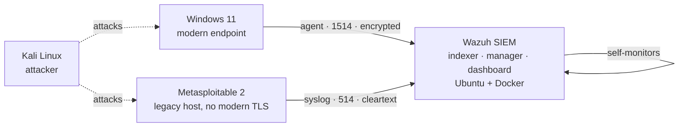

# Home SOC Lab — Wazuh SIEM, Attack Simulation, and MITRE ATT&CK Mapping

A four-machine security operations lab that runs the full detect-and-respond loop: an attacker box
generates real attacks against two victim endpoints, a Wazuh SIEM ingests and alerts on them, and
every alert is mapped to a MITRE ATT&CK technique and written up.

I'm a software engineer moving into cybersecurity. This lab is where I get hands-on with the work
itself — deploying and hardening a SIEM, getting endpoints reporting in, running attacks, and
deciding what the resulting alerts actually mean.

**The part worth reading:** [the judgment calls](#the-judgment-calls) and the
[issues log](docs/issues-log.md). Standing the stack up is a documented sequence anyone can follow.
Deciding *not* to "fix" a false positive, or choosing a lighter ingestion path for a host that can't
run an agent, is the part that resembles the job.

---

## Architecture

| Machine | Role | Platform | Ingestion path |
|---|---|---|---|
| Kali Linux | Attacker | Persistent live USB on a laptop (physical) | n/a |
| Ubuntu Server 24.04 LTS | SIEM — Wazuh 4.13.1 in Docker | VM (VirtualBox) | Agent (self-monitoring) |
| Windows 11 Enterprise (eval) | Modern victim endpoint | VM (VirtualBox) | Agent, TCP 1514, encrypted |
| Metasploitable 2 | Legacy victim (Ubuntu 8.04) | VM (VirtualBox) | Syslog, UDP 514, cleartext |

All hosts sit on one bridged LAN so the SIEM is reachable the way it would be on a real network.

**The loop:** attack from Kali → endpoints ship events to Wazuh → alerts fire → map to ATT&CK →
walk the response through the NIST incident-response lifecycle → document it here.

---

## What's in this repo

| Path | Contents |
|---|---|
| [`docs/`](docs/) | Build writeups by phase — lab build, SIEM deployment, endpoint onboarding |
| [`docs/issues-log.md`](docs/issues-log.md) | Every problem hit during the build, with root cause and resolution |
| [`detections/`](detections/) | One writeup per attack: command → alert → rule ID → ATT&CK technique |
| [`findings/`](findings/) | Security findings written the way they'd be handed to a customer |
| [`configs/`](configs/) | Sanitized configuration snippets referenced by the writeups |

---

## The judgment calls

The decisions I'd actually want to talk through, and why each went the way it did.

**Triaging a false positive instead of remediating it.**
The Wazuh indexer flagged "insecure file permissions (should be 0600)" against files in its own
`bin/` and `tools/` directories. Applying the recommended fix would strip execute bits from the
security plugin's own tooling — including `securityadmin.sh`, which is required to apply security
configuration at all. The correct action was no action, plus documentation of the reasoning.
Knowing when *not* to remediate is as much a part of the job as remediating.
([Issue I27](docs/issues-log.md#i27--indexer-insecure-file-permissions-warnings))

**Choosing a lighter ingestion path for a host that can't support an agent.**
Metasploitable 2 runs OpenSSL 0.9.8 and glibc 2.7 — the Wazuh agent can neither download (the TLS
handshake fails) nor install (glibc is too old). Rather than lose visibility on the host, I forwarded
its syslog to the manager over UDP 514 and confirmed delivery at the packet level with `tcpdump`.
That leaves the lab with two ingestion tiers — encrypted, authenticated agents for modern endpoints
and cleartext syslog for the legacy one — which is the same imperfect mix real environments run.
The tradeoff is itself worth documenting: the syslog path is unauthenticated and unencrypted, so it
is trusted only because it is confined to a lab segment.
([docs/03-endpoints-and-ingestion.md](docs/03-endpoints-and-ingestion.md))

**Hardening credentials before anything else.**
The stack ships with a published default password. Rotating it was step one — before enrolling a
single endpoint — using a bcrypt hash, scrubbing every plaintext occurrence from the compose file,
and verifying with credential-prompt `curl` rather than passing the password on the command line
where it would land in shell history and `ps` output. Maps to CIS Control 5.2.

**Proving the pipeline instead of assuming it.**
A raw `logger` test message never appeared in the dashboard, which looks like a broken pipe. It
isn't: the message matches no decoder and, with `<logall>` disabled, is never indexed. Rather than
trust either the dashboard's silence or my own assumption, I verified delivery on the wire with
`tcpdump` on the host interface. Confirm the mechanism, don't infer it from the symptom.
([Issue I25](docs/issues-log.md#i25--syslog-test-not-visible-in-discover))

**Keeping the blast radius small.**
Attacks target specific lab VM addresses only — never a subnet sweep, which would reach the real
home network the lab is bridged onto. The SIEM host is treated as infrastructure and is never a
target. Knowing the blast radius before acting is the whole discipline.

**Turning an obstacle into a finding.**
Modern SSH clients refuse to connect to the legacy host outright. That's an inconvenience during
setup — and also a legitimate weak-cryptography finding, so it's written up as one rather than
worked around silently.
([FIND-001](findings/FIND-001-deprecated-ssh-host-key-algorithms.md))

---

## Status

**Built and running:** all four machines on a bridged LAN; Wazuh 4.13.1 (indexer, manager,
dashboard) healthy in Docker; default credentials rotated; Windows 11 and the Ubuntu host enrolled
as agents; Metasploitable syslog forwarding confirmed on the wire.

**In progress:** attack simulations have been run from Kali (Nmap recon, Hydra SSH brute-force,
Metasploit, Burp Suite); the per-attack detection writeups in [`detections/`](detections/) are being
filled in with captured alerts and ATT&CK mappings.

**Next:** response walkthroughs against the NIST IR lifecycle for each detection, and custom Wazuh
rules for activity the default ruleset doesn't cover.

---

## Stack

Wazuh 4.13.1 (indexer · manager · dashboard) · Docker & Docker Compose · Ubuntu Server 24.04 LTS ·
VirtualBox · Kali Linux · Windows 11 · Metasploitable 2 · Nmap · Hydra · Metasploit · Burp Suite ·
tcpdump · Wireshark/tshark · MITRE ATT&CK · NIST SP 800-61 IR lifecycle

## Scope and safety

Everything here runs on isolated lab VMs I own. Attacks are directed at specific lab IP addresses,
never at a subnet range, and never at the physical host or any third-party system. Deliberately
vulnerable software (Metasploitable 2) is confined to the lab and is not internet-reachable.
Configuration snippets in this repo are sanitized — no credentials, hashes, keys, or certificates
are published.
